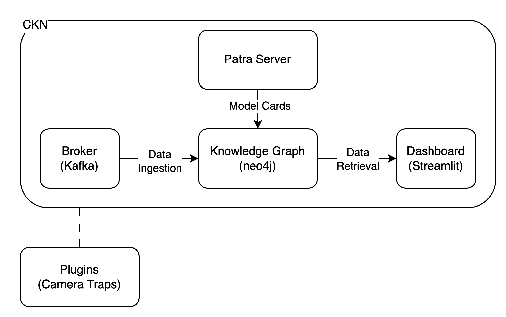

# Cyber-infrastructure Knowledge Network (CKN)

Cyber-infrastructure Knowledge Network (CKN) connects the Edge to the cloud by means of event streaming. It is built to push inference to the Edge, and will capture historical data about execution.



## Components

### Broker
**Apache Kafka** is used as the message broker. It operates on a publisher-subscriber model, allowing for real-time data streaming and processing. Kafka efficiently handles data streams by storing and processing them in the order they are received.

### Knowledge Graph
CKN employs a **Neo4j database** for its knowledge graph. Neo4j is a leading graph database known for its scalability, flexibility, and ability to handle complex relationships between data entities. It uses a property graph model with nodes and relationships, which makes it suitable for storing and querying connected data efficiently.

### Stream Processors
Stream processing in CKN is performed using a **tumbling window** approach. This method aggregates and summarizes data over fixed intervals, which is then published to a separate topic within the Kafka system.  More information is available in the [CKN Stream Processors repository](https://github.com/Data-to-Insight-Center/ckn-stream-processors).

### Dashboard
A **Streamlit dashboard** is provided for visualizing data from the knowledge graph. Streamlit is an open-source Python library that simplifies the creation of interactive web applications and dashboards. It allows users to visualize data easily and interact with machine learning models without requiring extensive front-end development skills.

## Plugins
**CKN Oracle Daemon**: Reads, processes, and sends camera trap events from Oracle Daemon and Power Measuring plugin.

---

## Getting Started

### Prerequisites

- **Docker** and **Docker Compose**: Ensure both are installed and running.
- **Available Ports**: Ensure the following ports are available: `7474`, `7687`, `2181`, `9092`, `8083`, `8502`.

### Quickstart

1. **Clone the Repository and Start Services**:
   ```bash
   git clone https://github.com/Data-to-Insight-Center/cyberinfrastructure-knowledge-network.git
   cd cyberinfrastructure-knowledge-network
   make up
   ```

   Once setup is complete, verify that all modules are running:
   ```bash
   docker compose ps
   ```

2. **Produce an Example Event**:
   To stream a sample event, navigate to the `examples` directory and run:
    ```bash
   docker compose -f examples/docker-compose.yml up -d --build
   ```
   
   View streamed data on the [CKN dashboard](http://localhost:8502/Camera_Traps) or via the [Neo4j Browser](http://localhost:7474/browser/). Use `neo4j` as the username and replace `PWD_HERE` with your password, then run:
   ```cypher
   MATCH (n) RETURN n
   ```

3. **Shut Down and Clean Up**:
   To stop and remove all running containers:
    ```bash
   make down
   docker compose -f examples/docker-compose.yml down
    ```

---

## License

The Cyberinfrastructure Knowledge Network is copyrighted by the Indiana University Board of Trustees and is distributed under the BSD 3-Clause License. See `LICENSE.txt` for more information.

## Reference

S. Withana and B. Plale, "CKN: An Edge AI Distributed Framework," *2023 IEEE 19th International Conference on e-Science (e-Science)*, Limassol, Cyprus, 2023, pp. 1-10, doi: 10.1109/e-Science58273.2023.10254827.
