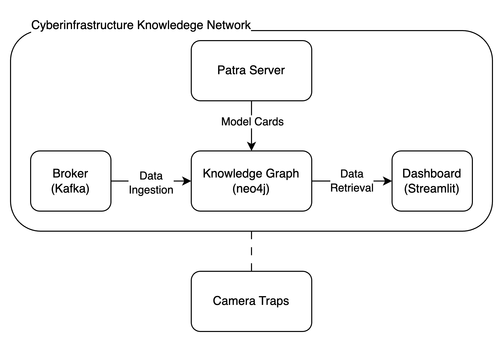

# Cyberinfrastructure Knowledge Network (CKN)

## Overview

The Cyberinfrastructure Knowledge Network (CKN) repository provides the setup and components required to run CKN for the TAPIS Camera Traps application. This system integrates various services to manage and analyze camera trap data using a sophisticated pipeline involving data ingestion, processing, and visualization.



## Components

### Oracle CKN Daemon
- **Purpose**: Reads, processes, and sends camera trap events from Oracle.
- **Functionality**: Extracts only those events that have been fully processed by the image scoring plugin.
- **Deployment**: Includes Dockerfile and Docker Compose files for straightforward deployment of the daemon.

### Dashboard
- **Purpose**: Provides a CKN Analytics dashboard for visualizing camera trap data.
- **Features**: Offers a Chatbot and interactive insights into the camera traps data.

### CKN Broker
- **Purpose**: Sets up Kafka broker and connectors for streaming data.
- **Components**: Configures Kafka brokers, topics, and connectors. Includes knowledge graph sinks for handling camera traps events.

### CKN KG (Knowledge Graph)
- **Purpose**: Defines the Docker Compose setup for the knowledge graph.
- **Components**: Manages the knowledge graph's infrastructure and connections.

## Quickstart Guide
To start CKN run:

```bash
docker-compose up
```

## Stream Processors

For additional stream processing capabilities, visit the [CKN Stream Processors repository](https://github.com/Data-to-Insight-Center/ckn-stream-processors). This repository contains stream processors that integrate with CKN to enhance data processing workflows.
